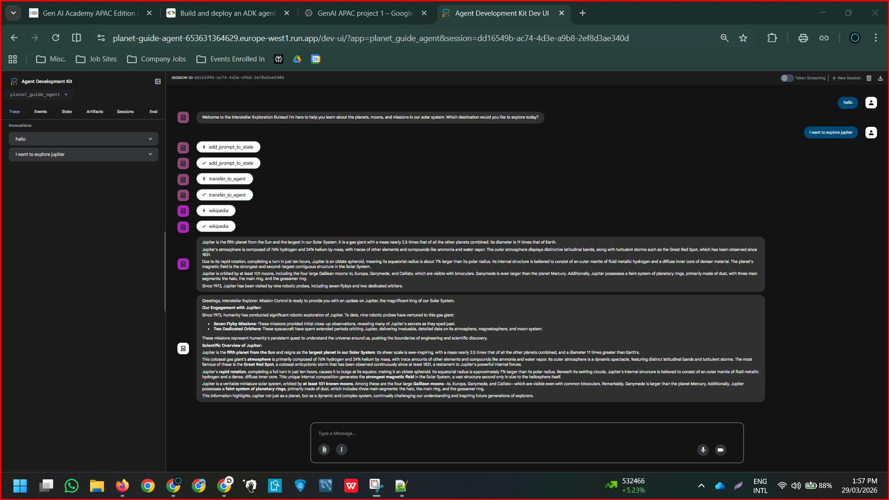

# Multi-agent-planetary-explorer-ADK
# 🚀 Planet Guide AI Agent  
### Multi-Agent Planetary Explorer using Google ADK + Gemini

---

## 📌 Problem Statement
Accessing reliable and structured information about planets, moons, and space missions often requires manually searching across multiple sources, which can be time-consuming and fragmented.

---

## 🎯 Objective
To build an AI-powered conversational assistant that:
- Understands natural language queries about celestial bodies  
- Retrieves real-time scientific information  
- Presents responses in a structured, engaging format  

---

## 🧠 Solution Overview
This project implements a **sequential multi-agent pipeline** using Google’s Agent Development Kit (ADK).

Each agent performs a specialized role:
- Input handling  
- Data retrieval  
- Response formatting  

This separation improves clarity, modularity, and response quality.

---

## 🏗️ Architecture

### 🔹 Agent Workflow
User Input → Greeter Agent → Researcher Agent → Formatter Agent → Response

### 🔹 Agents Breakdown

1. 🛰️ **Greeter Agent**
   - Welcomes the user  
   - Captures and stores the query in shared state  

2. 🔬 **Planetary Researcher Agent**
   - Retrieves real-time data using Wikipedia  
   - Extracts scientific and mission-related information  

3. 🧾 **Response Formatter Agent**
   - Converts raw research into a structured  
   - “Mission Control-style” response  

---

## 🛠️ Tech Stack
- **Google ADK (Agent Development Kit)**  
- **Gemini (via Vertex AI)**  
- **Python 3.12**  
- **LangChain + Wikipedia API**  
- **Google Cloud Run (Deployment)**  
- **Docker**  
- **Google Cloud Logging**  

---

## 🔍 Key Features
- Conversational AI for planetary exploration  
- Real-time knowledge retrieval using Wikipedia  
- Modular multi-agent pipeline  
- Shared state management across agents  
- Mission Control styled responses  
- Cloud-deployed and accessible via web interface  

---

## 💬 Sample Queries
- “Tell me about Mars”  
- “What is the atmosphere of Venus?”  
- “Are there any missions to Jupiter?”  

---

## 📸 Project Output

---

## 🌍 Real-World Applications
- Educational AI assistants (EdTech platforms)  
- Interactive learning tools for astronomy  
- AI-powered knowledge assistants  
- Demonstration of multi-agent system design in production  

---

## 💡 Key Insights
- Multi-agent pipelines improve modularity and response quality  
- Separating research and formatting enhances clarity  
- Tool integration enables real-time, dynamic responses  

---

## ⚠️ Limitations
- Depends on Wikipedia for external knowledge  
- May return incomplete results for niche queries  
- No fallback mechanism for failed tool calls  
- Limited multi-turn conversational memory  

---

## 🚀 Future Improvements
- Add more data sources beyond Wikipedia  
- Implement conversation memory for multi-turn context  
- Improve UI/UX for better user interaction  
- Add error handling and fallback mechanisms  

---

📂 Project Structure

---

## 🔗 Live Demo
 Link :> https://planet-guide-agent-653631364629.europe-west1.run.app
 
---

## 👨‍💻 Author
**Dhyan Jain**  
- Analyst | Data & AI Enthusiast  
- Skilled in SQL, Power BI, Analytics, and AI-driven solutions  

🔗 LinkedIn: https://www.linkedin.com/in/dhyanjain2701/

---

## ⭐ If you found this interesting
Feel free to star ⭐ the repo and connect!

